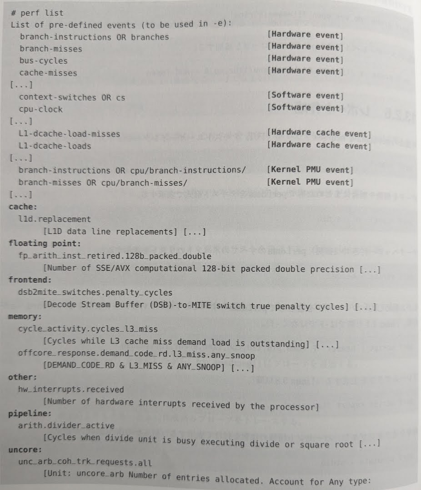
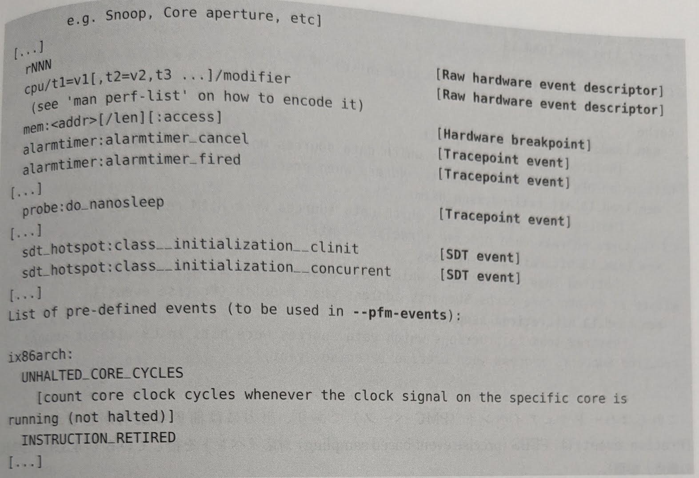
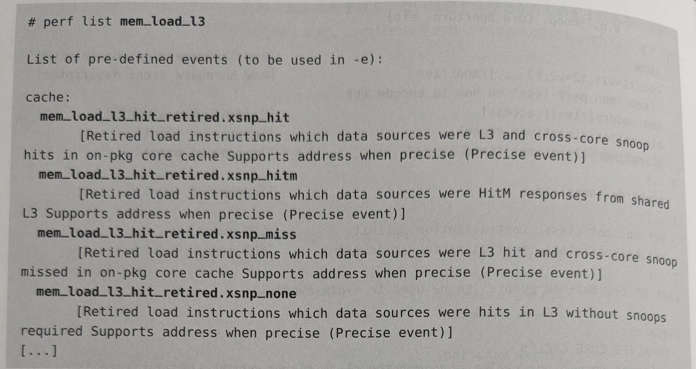
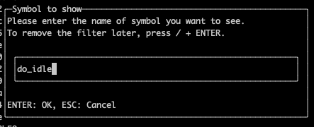

# 第13章 perf  
- perf(1)はLinuxの公式プロファイラ
- Linuxカーネルソースのtools/perf以下にソース
  - 大規模で複雑なユーザレベルプログラムでありながらLinuxカーネルソースツリーに含まれている特異な存在
- プロファイリング、トレーシング、スクリプティングの機能を持つ多機能ツール
- カーネルの`perf_events`サブシステムのフロントエンド
  - Performance Counters for Linux(PCL), Linux Performance Events(LPE)とも呼ばれる
  - PMC(Performance Monitoring Counter)の機能としてスタート
- 特にCPUの分析では他のトレーサー(Ftrace, BPF)よりも適している
<br></br>
- 本章の内容
  - サブコマンドの概要：13.1
  - 1行プログラム：13.2
  - イベント：13.3-13.7
  - コマンド：13.8-13.13
  - perfのドキュメント：13.14

## 13.1　サブコマンドの概要
- perf(1)の機能はサブコマンドによって実行
- 一般的な例
  - 2つのサブコマンドを使用
    - record: イベントをインストルメンテーションしてファイルに保存(13.9)
    - report: ファイルの内容のサマリーを表示(13.10)
  - 30秒間にわたって任意のCPUで実行されたプログラムを99Hzでサンプリング
    - 🤔コンテナで実行したためか本の出力とは異なる...
```
/# perf record -F 99 -a -- sleep 30
[ perf record: Woken up 1 times to write data ]
[ perf record: Captured and wrote 1.075 MB perf.data (19747 samples) ]

/# perf report --stdio
# To display the perf.data header info, please use --header/--header-only options.
#
#
# Total Lost Samples: 0
#
# Samples: 19K of event 'cpu-clock:pppH'
# Event count (approx.): 199464644470
#
# Overhead  Command      Shared Object      Symbol                       
# ........  ...........  .................  .............................
#
    80.09%  docker-init  [kernel.kallsyms]  [k] do_idle
    19.63%  swapper      [kernel.kallsyms]  [k] do_idle
     0.08%  docker-init  [kernel.kallsyms]  [k] __do_softirq
     0.02%  docker-init  [kernel.kallsyms]  [k] finish_task_switch.isra.0
     0.02%  runc         [kernel.kallsyms]  [k] do_idle
     0.02%  swapper      [kernel.kallsyms]  [k] __do_softirq

（省略）
```
- 重要なperfサブコマンド(表13-1を元に一部改変)

| 節 | コマンド | 説明 |  
| ---- | ---- | ---- |  
|-|annotate|perf.data(oerf recordで作成したファイル)を読み、注釈付きのコードを表示する|
|-|archive|デバッグ、シンボル情報を含むポータブルなperf.dataファイルを作る|
|-|bench|システムマイクロベンチマーク|
|-|buildid-cache|ビルドIDキャッシュ（USDTプローブが使う）を管理する|
|-|c2c|キャッシュライン分析ツール|
|-|diff|二つのperf.dataファイルを読み、差分プロファイルを表示|
|-|evlist|perf.dataファイル内のイベント名のリストを表示|
|14.12|ftrace|Ftraceトレーサーに対するperf(1)のインタフェース|
|-|inject|イベントストリームに情報を追加するためのフィルタ|
|-|kmem|カーネルメモリ(slab)のプロパティをトレース/計測する|
|11.3.3|kvm|kvmゲストインスタンスをトレース/計測する|
|13.3|list|イベントタイプのリストを表示|
|-|lock|ロックイベントを分析|
|-|mem|メモリアクセスをプロファイリング|
|13.7|probe|新しい動的プローブを定義|
|13.9|record|コマンドを実行し、プロファイルをperf.dataに記録|
|13.10|report|perf.data(perf recordで作成したファイル)を読み、プロファイルを表示|
|13.6.13|sched|スケジューラのプロパティ(レイテンシ)をトレース/計測する|
|13.11|script|perf.data(perf recordで作成したファイル)を読み、トレース出力を表示|
|13.8|stat|コマンドを実行しパフォーマンスカウンタ統計を集める|
|-|timechart|ワークロード実行中のシステムの振る舞い全体を可視化|
|-|top|リアルタイムで画面が更新される|
|13.12|trace|ライブトレーサー(デフォルトでシステムコール)| 

- よく使われるperfサブコマンドとそのデータソース、出力タイプ()


## 13.2　1行プログラム	
- perf(1)の多彩な機能の具体例
  - CPUを指定する-aオプションはLinux4.11でデフォルトになった
- より多くの例が見たい場合は以下の筆者のサイトを参照
  - https://www.brendangregg.com/perf.html

### 13.2.1　イベントのリストの表示
- 現在わかっている全てのイベントのリストを表示
```bash
perf list
```
```
List of pre-defined events (to be used in -e):

  alignment-faults                                   [Software event]
  bpf-output                                         [Software event]
  cgroup-switches                                    [Software event]
  context-switches OR cs                             [Software event]
  cpu-clock                                          [Software event]
  cpu-migrations OR migrations                       [Software event]
  dummy                                              [Software event]
  emulation-faults                                   [Software event]
  major-faults                                       [Software event]
  minor-faults                                       [Software event]
  page-faults OR faults                              [Software event]
  task-clock                                         [Software event]

  duration_time                                      [Tool event]

  rNNN                                               [Raw hardware event descriptor]
  cpu/t1=v1[,t2=v2,t3 ...]/modifier                  [Raw hardware event descriptor]
   (see 'man perf-list' on how to encode it)

  mem:<addr>[/len][:access]                          [Hardware breakpoint]

  alarmtimer:alarmtimer_cancel                       [Tracepoint event]
  alarmtimer:alarmtimer_fired                        [Tracepoint event]
  alarmtimer:alarmtimer_start                        [Tracepoint event]
  （以下略）
```
- schedトレースポイントのリストを表示
```bash
perf list 'sched:*'
```
```
List of pre-defined events (to be used in -e):

  sched:sched_kthread_stop                           [Tracepoint event]
  sched:sched_kthread_stop_ret                       [Tracepoint event]
  sched:sched_kthread_work_execute_end               [Tracepoint event]
  sched:sched_kthread_work_execute_start             [Tracepoint event]
  sched:sched_kthread_work_queue_work                [Tracepoint event]
  sched:sched_migrate_task                           [Tracepoint event]
  sched:sched_move_numa                              [Tracepoint event]
  sched:sched_pi_setprio                             [Tracepoint event]
  sched:sched_process_exec                           [Tracepoint event]
  sched:sched_process_exit                           [Tracepoint event]
  sched:sched_process_fork                           [Tracepoint event]
  sched:sched_process_free                           [Tracepoint event]
  sched:sched_process_hang                           [Tracepoint event]
  sched:sched_process_wait                           [Tracepoint event]
  sched:sched_stat_runtime                           [Tracepoint event]
  sched:sched_stick_numa                             [Tracepoint event]
  sched:sched_swap_numa                              [Tracepoint event]
  sched:sched_switch                                 [Tracepoint event]
  sched:sched_wait_task                              [Tracepoint event]
  sched:sched_wake_idle_without_ipi                  [Tracepoint event]
  sched:sched_wakeup                                 [Tracepoint event]
  sched:sched_wakeup_new                             [Tracepoint event]
  sched:sched_waking                                 [Tracepoint event]
```
- 名前に"block"という文字列が含まれているイベントのリストを表示
```bash
perf list block
```
```
List of pre-defined events (to be used in -e):


  block:block_bio_backmerge                          [Tracepoint event]
  block:block_bio_bounce                             [Tracepoint event]
  block:block_bio_complete                           [Tracepoint event]
  block:block_bio_frontmerge                         [Tracepoint event]
  block:block_bio_queue                              [Tracepoint event]
  block:block_bio_remap                              [Tracepoint event]
  block:block_dirty_buffer                           [Tracepoint event]
  block:block_getrq                                  [Tracepoint event]
  block:block_io_done                                [Tracepoint event]
  block:block_io_start                               [Tracepoint event]
  block:block_plug                                   [Tracepoint event]
  block:block_rq_complete                            [Tracepoint event]
  block:block_rq_error                               [Tracepoint event]
  block:block_rq_insert                              [Tracepoint event]
  block:block_rq_issue                               [Tracepoint event]
  block:block_rq_merge                               [Tracepoint event]
  block:block_rq_remap                               [Tracepoint event]
  block:block_rq_requeue                             [Tracepoint event]
  block:block_split                                  [Tracepoint event]
  block:block_touch_buffer                           [Tracepoint event]
  block:block_unplug                                 [Tracepoint event]
  erofs:erofs_map_blocks_enter                       [Tracepoint event]
  erofs:erofs_map_blocks_exit                        [Tracepoint event]
  erofs:z_erofs_map_blocks_iter_enter                [Tracepoint event]
  erofs:z_erofs_map_blocks_iter_exit                 [Tracepoint event]
  ext4:ext4_alloc_da_blocks                          [Tracepoint event]
  ext4:ext4_allocate_blocks                          [Tracepoint event]
  ext4:ext4_discard_blocks                           [Tracepoint event]
  ext4:ext4_es_insert_delayed_block                  [Tracepoint event]
  ext4:ext4_ext_map_blocks_enter                     [Tracepoint event]
  ext4:ext4_ext_map_blocks_exit                      [Tracepoint event]
  ext4:ext4_free_blocks                              [Tracepoint event]
  ext4:ext4_ind_map_blocks_enter                     [Tracepoint event]
  ext4:ext4_ind_map_blocks_exit                      [Tracepoint event]
  ext4:ext4_read_block_bitmap_load                   [Tracepoint event]
  ext4:ext4_remove_blocks                            [Tracepoint event]
  ext4:ext4_request_blocks                           [Tracepoint event]
  filelock:break_lease_block                         [Tracepoint event]
  filelock:break_lease_noblock                       [Tracepoint event]
  filelock:break_lease_unblock                       [Tracepoint event]
  jbd2:jbd2_write_superblock                         [Tracepoint event]

```
- 現在使える動的プローブのリストを表示
  - 🙅‍♀️特に何も出力されず
```bash
perf probe -l
```

### 13.2.2　イベント数の計算
- 指定したコマンドのPMC統計を表示
```bash
perf stat command
```
```
# perf stat top
 Performance counter stats for 'top':

              7.22 msec task-clock                #    0.001 CPUs utilized
                 5      context-switches          #  692.769 /sec
                 1      cpu-migrations            #  138.554 /sec
               204      page-faults               #   28.265 K/sec
   <not supported>      cycles
   <not supported>      instructions
   <not supported>      branches
   <not supported>      branch-misses

       6.457611586 seconds time elapsed

       0.003736000 seconds user
       0.004193000 seconds sys
```
- Ctrl＋Cが押されるまで、指定したPIDのPMC統計を表示
```bash
perf stat -p PID
```
```
# yes > dev/null
# ps aux
USER       PID %CPU %MEM    VSZ   RSS TTY      STAT START   TIME COMMAND
root         1  0.0  0.0   4136  3072 pts/0    Ss+  14:00   0:00 /bin/bash
root         9  0.0  0.0   4136  3200 pts/1    Ss   14:00   0:00 bash
root        17  0.0  0.0   4136  3200 pts/2    Ss   14:00   0:00 bash
root        58  101  0.0   2204  1024 pts/2    R+   14:47   0:04 yes
root        59  0.0  0.0   6412  2432 pts/1    R+   14:48   0:00 ps aux
# perf stat -p 58
^C
 Performance counter stats for process id '58':

           2981.00 msec task-clock                #    1.000 CPUs utilized
                 0      context-switches          #    0.000 /sec
                 0      cpu-migrations            #    0.000 /sec
                 0      page-faults               #    0.000 /sec
   <not supported>      cycles
   <not supported>      instructions
   <not supported>      branches
   <not supported>      branch-misses

       2.981008293 seconds time elapsed
```
- 5秒間にわたってシステム全体のPMC統計を表示
```bash
perf stat -a sleep 5
```
```
# perf stat -a sleep 5

 Performance counter stats for 'system wide':

          40039.70 msec cpu-clock                 #    8.000 CPUs utilized
              7182      context-switches          #  179.372 /sec
               181      cpu-migrations            #    4.521 /sec
               621      page-faults               #   15.510 /sec
   <not supported>      cycles
   <not supported>      instructions
   <not supported>      branches
   <not supported>      branch-misses

       5.005025627 seconds time elapsed
```
- commandのCPU最終レベルキャッシュ(LLC)統計を表示
```bash
perf stat -e LLC-loads,LLC-load-misses,LLC-stores,LLC-prefetches command
```
🙅‍♀️サポートしていない
```
# perf stat -e LLC-loads,LLC-load-misses,LLC-stores,LLC-prefetches top
 Performance counter stats for 'top':

   <not supported>      LLC-loads
   <not supported>      LLC-load-misses
   <not supported>      LLC-stores
   <not supported>      LLC-prefetches

      16.929967591 seconds time elapsed

       0.002763000 seconds user
       0.007368000 seconds sys
```
- 元のPMC仕様(Intel)を使ってホルトしていないコアサイクルを数える
```bash
perf stat -e r003c -a sleep 5 
```
🙅‍♀️サポートしていない
```
# perf stat -e r003c -a sleep 5

 Performance counter stats for 'system wide':

   <not supported>      r003c

       5.004797836 seconds time elapsed
```
- 元のPMC仕様(Intel)の冗長表示を使ってフロントエンドストールを数える
```bash
perf stat -e cycles -e cpu/event=0x0e,umask=0x01,inv,cmask=0x01/ -a sleep 5
```
🙅‍♀️サポートしていない
```
# perf stat -e cpu/event=0x0e,umask=0x01,inv,cmask=0x01/ -a sleep 5
event syntax error: 'cpu/event=0x0e,umask=0x01,inv,cmask=0x01/'
                     \___ Cannot find PMU `cpu'. Missing kernel support?
```
- システム全体で1秒間に発生したシステムコールを数える
```bash
perf stat -e raw_syscalls:sys_enter -I 1000 -a
```
```
# perf stat -e raw_syscalls:sys_enter -I 1000 -a
#           time             counts unit events
     1.001674584               1227      raw_syscalls:sys_enter
     2.008393084               1106      raw_syscalls:sys_enter
     3.011602418               1134      raw_syscalls:sys_enter
```
- 指定したPIDによるシステムコールをタイプ別に数える
```bash
perf stat -e 'syscalls:sys_enter_*' -p PID
```
```
# yes > dev/null
# ps aux
USER       PID %CPU %MEM    VSZ   RSS TTY      STAT START   TIME COMMAND
root         1  0.0  0.0   4136  3072 pts/0    Ss+  14:00   0:00 /bin/bash
root         9  0.0  0.0   4136  3200 pts/1    Ss   14:00   0:00 bash
root        17  0.0  0.0   4136  3200 pts/2    Ss   14:00   0:00 bash
root        72 82.2  0.0   2204  1024 pts/2    R+   14:54   0:04 yes
root        73  0.0  0.0   6412  2432 pts/1    R+   14:55   0:00 ps aux

# perf stat -e 'syscalls:sys_enter_*' -p 72
^C
 Performance counter stats for process id '72':

                 0      syscalls:sys_enter_socket
                 0      syscalls:sys_enter_socketpair
                 0      syscalls:sys_enter_bind
                 0      syscalls:sys_enter_listen
                 0      syscalls:sys_enter_accept4
                 0      syscalls:sys_enter_accept
                 0      syscalls:sys_enter_connect
                 0      syscalls:sys_enter_getsockname
                 （以下略）
```
- 10秒間にわたってシステム全体のブロックI/Oを数える
```
perf stat -e 'block:*' -a sleep 10
```
```
# perf stat -e 'block:*' -a sleep 10

 Performance counter stats for 'system wide':

                 0      block:block_touch_buffer
                 0      block:block_dirty_buffer
                 0      block:block_rq_requeue
                 0      block:block_rq_complete
                 0      block:block_rq_error
                 0      block:block_rq_insert
                 0      block:block_rq_issue
                 0      block:block_rq_merge
                 0      block:block_io_start
                 0      block:block_io_done
                 0      block:block_bio_complete
                 0      block:block_bio_bounce
                 0      block:block_bio_backmerge
                 0      block:block_bio_frontmerge
                 0      block:block_bio_queue
                 0      block:block_getrq
                 0      block:block_plug
                 0      block:block_unplug
                 0      block:block_split
                 0      block:block_bio_remap
                 0      block:block_rq_remap

      10.002889880 seconds time elapsed
```

### 13.2.3　プロファイリング
- commandのon-CPU関数を99Hzでサンプリング
```bash
perf record -F 99 command
```
```
# perf record -F 99 top
[ perf record: Woken up 1 times to write data ]
[ perf record: Captured and wrote 0.004 MB perf.data ]
```
- 10秒間に渡ってシステム全体のCPUスタックトレースをサンプリング(フレームポインタを使って)
```bash
perf record -F 99 -a -g sleep 10
```
```
# perf record -F 99 -a -g sleep 10
[ perf record: Woken up 1 times to write data ]
[ perf record: Captured and wrote 0.749 MB perf.data (6996 samples) ]
```
- PIDのCPUスタックトレースをサンプリングし、dwarf(debuginfo)を使ってスタックをアンワインド
```bash
perf record -F 99 -p PID --call-graph dwarf sleep 10
```
```
# yes > dev/null
# ps aux
USER       PID %CPU %MEM    VSZ   RSS TTY      STAT START   TIME COMMAND
root         1  0.0  0.0   4136  3072 pts/0    Ss+  14:00   0:00 /bin/bash
root         9  0.0  0.0   4136  3200 pts/1    Ss   14:00   0:00 bash
root        17  0.0  0.0   4136  3200 pts/2    Ss   14:00   0:00 bash
root        98  100  0.0   2204  1024 pts/2    R+   15:09   0:04 yes
root        99  0.0  0.0   6412  2432 pts/1    R+   15:09   0:00 ps aux
# perf record -F 99 -p 98 --call-graph dwarf sleep 10
[ perf record: Woken up 33 times to write data ]
[ perf record: Captured and wrote 8.096 MB perf.data (990 samples) ]
```
- /sys/fs/cgroup/perf_event cgroupによりコンテナのCPUスタックトレースをサンプリング
```bash
perf record -F 99 -e cpu-clock --cgroup=docker/1d567f4393190204...etc... -a sleep 10
```
- LBR(IntelのLast Branch Record)を使ってシステム全体のCPUスタックトレースをサンプリング
```bash
perf record -F 99 -a --call-graph lbr sleep 10
```
🙅‍♀️サポートしていない
```
# perf record -F 99 -a --call-graph lbr sleep 10
Error:
cpu-clock:pppH: PMU Hardware doesn't support sampling/overflow-interrupts. Try 'perf stat'
```
- 5秒間に渡って100回に1度ずつLLCキャッシュミスのCPUスタックトレースをサンプリング
```bash
perf record -e LLC-load-misses -c 100 -ag sleep 5
```
🙅‍♀️サポートしていない
```
# perf record -e LLC-load-misses -c 100 -ag sleep 5
Error:
The LLC-load-misses event is not supported.
```
- 5秒間に渡ってon-CPUユーザ命令を正確に(例えばIntelのPEBSを使って)サンプリング
```bash
perf record -e cycles:up -a sleep 5 
```
```
# perf record -e cycles:up -a sleep 5
[ perf record: Woken up 1 times to write data ]
[ perf record: Captured and wrote 0.187 MB perf.data (3255 samples) ]
```
- 49HzでCPUをサンプリングし、トッププロセスの名前とセグメントをライブ表示
```bash
perf top -F 49 -ns comm,dso
```
```
# perf top -F 49 -ns comm,dso

Samples: 8K of event 'cpu-clock:pppH', 49 Hz, Event count (approx.): 97572272806 lost: 0/0 drop: 0/0
Overhead       Samples  Command      Shared Object
  97.17%          4643  docker-init  [kernel]
   2.68%           126  swapper      [kernel]
   0.09%             0  docker-init  [unknown]
   0.05%             0  perf         [kernel]
   0.01%             0  perf         perf
```

### 13.2.4　静的トレーシング
- Ctrl+Cが押されるまで、新しいプロセスをトレース
```bash
perf record -e sched:sched_process_exec -a
```
topとyesコマンドを実行した
```
# perf record -e sched:sched_process_exec -a
^C[ perf record: Woken up 1 times to write data ]
[ perf record: Captured and wrote 0.011 MB perf.data (2 samples) ]
```
- 1秒間に渡って、スタックトレース付きでコンテキストスイッチのサブセットをサンプリング
```bash
perf record -e context-switches -a -g sleep 1
```
```
# perf record -e context-switches -a -g sleep 1
[ perf record: Woken up 1 times to write data ]
[ perf record: Captured and wrote 0.025 MB perf.data (82 samples) ]
```
- 1秒間に渡って、スタックトレース付きで全てのコンテキストスイッチをトレース
```bash
perf record -e sched:sched_switch -a -g sleep 1
```
```
# perf record -e sched:sched_switch -a -g sleep 1
[ perf record: Woken up 1 times to write data ]
[ perf record: Captured and wrote 0.284 MB perf.data (1132 samples) ]
```
- 1秒間に渡って、5レベルの深いスタックトレース付きで全てのコンテキストスイッチをトレース
```bash
perf record -e sched:sched_switch/max-stack=5/ -a sleep 1
```
```
# perf record -e sched:sched_switch/max-stack=5/ -a sleep 1
[ perf record: Woken up 1 times to write data ]
[ perf record: Captured and wrote 0.232 MB perf.data (1237 samples) ]
```
- Ctrl+Cが押されるまで、スタックトレース付きでconnect(2)（アウトバウンド接続）呼び出しをトレース
```bash
perf record -e syscalls:sys_enter_connect -a -g
```
```
# perf record -e syscalls:sys_enter_connect -a -g
^C[ perf record: Woken up 1 times to write data ]
[ perf record: Captured and wrote 0.008 MB perf.data (1 samples) ]
```
- Ctrl+Cが押されるまで、1秒あたり100個以内のブロックデバイス要求をサンプリング
```bash
perf record -F 100 -e block:block_rq_issue -a
```
```
# perf record -F 100 -e block:block_rq_issue -a
^C[ perf record: Woken up 1 times to write data ]
[ perf record: Captured and wrote 0.009 MB perf.data (9 samples) ]
```
- Ctrl+Cが押されるまで、タイムスタンプ付きで全てのブロックデバイス要求の発行と完了をトレース
```bash
perf record -e block:block_rq_issue,block:block_rq_complete -a
```
```
# perf record -e block:block_rq_issue,block:block_rq_complete -a
^C[ perf record: Woken up 1 times to write data ]
[ perf record: Captured and wrote 0.008 MB perf.data ]
```
- Ctrl+Cが押されるまで、64KB以上のサイズの全てのブロックデバイス要求をトレース
```bash
perf record -e block:block_rq_issue --filter 'bytes >= 65536'
```
```
# perf record -e block:block_rq_issue --filter 'bytes >= 65536'
^C[ perf record: Woken up 1 times to write data ]
[ perf record: Captured and wrote 0.007 MB perf.data ]
```
- Ctrl+Cが押されるまで、全てのext4呼び出しをトレースし、ext4ではない場所に書き込む
```bash
perf record -e 'ext4:*' -o /tmp/perf.data -a
```
```
# perf record -e 'ext4:*' -o /tmp/perf.data -a
^C[ perf record: Woken up 0 times to write data ]
[ perf record: Captured and wrote 808.425 MB /tmp/perf.data (8072032 samples) ]
# ll /tmp/perf.data
-rw------- 1 root root 847830214 Jan  4 03:36 /tmp/perf.data
```
- http__server__request USDTイベント(Node.js Linux4.0以降)をトレース
```bash
perf record -e sdt_node:http__server__request -a
```
🙅‍♀️設定が必要そう
```
# perf record -e sdt_node:http__server__request -a
event syntax error: 'sdt_node:http__server__request'
                     \___ unknown tracepoint

Error:	File /sys/kernel/tracing/events/sdt_node/http__server__request not found.
Hint:	SDT event cannot be directly recorded on.
	Please first use 'perf probe sdt_node:http__server__request' before recording it.
```
- Ctrl+Cが押されるまで、ブロックデバイス要求をトレースし、ライブ出力（perf.dataに出力しない）
```bash
perf trace -e block:block_rq_issue 
```
```
# perf trace -e block:block_rq_issue
     0.000 :0/0 block:block_rq_issue(dev: 266338304, sector: 59240088, nr_sector: 48, bytes: 24576, rwbs: "WS", comm: "jbd2/vda1-8", cmd: "")
     1.491 :0/0 block:block_rq_issue(dev: 266338304, rwbs: "FF", comm: "kworker/3:1H", cmd: "")
     1.550 :0/0 block:block_rq_issue(dev: 266338304, sector: 117721288, nr_sector: 8, bytes: 4096, rwbs: "W", comm: "kworker/u16:3", cmd: "")
     2.402 :0/0 block:block_rq_issue(dev: 266338304, sector: 59240136, nr_sector: 8, bytes: 4096, rwbs: "WS", comm: "kworker/0:1H", cmd: "")
     3.484 :0/0 block:block_rq_issue(dev: 266338304, rwbs: "FF", comm: "kworker/0:1H", cmd: "")
  6144.718 :0/0 block:block_rq_issue(dev: 266338304, sector: 59240144, nr_sector: 32, bytes: 16384, rwbs: "WS", comm: "jbd2/vda1-8", cmd: "")
  6146.229 :0/0 block:block_rq_issue(dev: 266338304, rwbs: "FF", comm: "kworker/4:1H", cmd: "")
  6146.639 :0/0 block:block_rq_issue(dev: 266338304, sector: 59240176, nr_sector: 8, bytes: 4096, rwbs: "WS", comm: "kworker/0:1H", cmd: "")
  6147.792 :0/0 block:block_rq_issue(dev: 266338304, rwbs: "FF", comm: "kworker/0:1H", cmd: "")
```
- ブロックデバイス要求の発行と完了をトレースし、ライブ出力
```bash
perf trace -e block:block_rq_issue,block:block_rq_complete 
```
```
# perf trace -e block:block_rq_issue,block:block_rq_complete
     0.000 :0/0 block:block_rq_issue(dev: 266338304, sector: 2048, nr_sector: 8, bytes: 4096, rwbs: "WM", comm: "kworker/u16:3", cmd: "")
     0.060 :0/0 block:block_rq_issue(dev: 266338304, sector: 2112, nr_sector: 8, bytes: 4096, rwbs: "WM", comm: "kworker/u16:3", cmd: "")
     0.132 :0/0 block:block_rq_issue(dev: 266338304, sector: 117442568, nr_sector: 8, bytes: 4096, rwbs: "WM", comm: "kworker/u16:3", cmd: "")
     1.707 :0/0 block:block_rq_complete(dev: 266338304, sector: 2048, nr_sector: 8, rwbs: "WM", cmd: "")
     1.856 :0/0 block:block_rq_complete(dev: 266338304, sector: 2112, nr_sector: 8, rwbs: "WM", cmd: "")
     1.884 :0/0 block:block_rq_complete(dev: 266338304, sector: 117442568, nr_sector: 8, rwbs: "WM", cmd: "")
  2047.090 :0/0 block:block_rq_issue(dev: 266338304, sector: 59240264, nr_sector: 56, bytes: 28672, rwbs: "WS", comm: "jbd2/vda1-8", cmd: "")
  2047.066 :0/0 block:block_rq_issue(dev: 266338304, sector: 113015024, nr_sector: 8, bytes: 4096, rwbs: "W", comm: "kworker/u16:3", cmd: "")
  2048.555 :0/0 block:block_rq_complete(dev: 266338304, sector: 59240264, nr_sector: 56, rwbs: "WS", cmd: "")
  2048.663 :0/0 block:block_rq_issue(dev: 266338304, rwbs: "FF", comm: "kworker/0:1H", cmd: "")
  2051.118 :0/0 block:block_rq_complete(dev: 266338304, sector: 113015024, nr_sector: 8, rwbs: "W", cmd: "")
  2051.988 :0/0 block:block_rq_complete(dev: 266338304, sector: -1, rwbs: "FF", cmd: "")
  2052.039 :0/0 block:block_rq_issue(dev: 266338304, sector: 59240320, nr_sector: 8, bytes: 4096, rwbs: "WS", comm: "kworker/0:1H", cmd: "")
  2053.380 :0/0 block:block_rq_complete(dev: 266338304, sector: 59240320, nr_sector: 8, rwbs: "WS", cmd: "")
  2053.432 :0/0 block:block_rq_issue(dev: 266338304, rwbs: "FF", comm: "kworker/0:1H", cmd: "")
  2054.307 :0/0 block:block_rq_complete(dev: 266338304, sector: -1, rwbs: "FF", cmd: "")
  2054.347 :0/0 block:block_rq_complete(dev: 266338304, sector: 59240320, rwbs: "WS", cmd: "")
```
- システム全体のシステムコールをトレースし、ライブ出力（膨大な出力になる）
```bash
perf trace
```
```
# perf trace
     0.000 ( 0.013 ms): perf/105 ioctl(fd: 13<anon_inode:[perf_event]>, cmd: 9216)                     = 0
         ? (         ): :0/0  ... [continued]: epoll_pwait())                                      = 1
     0.022 (         ): perf/105 sched_setaffinity(len: 512, user_mask_ptr: 0xaaaaf9390a10)         ...
     0.858 ( 0.016 ms): :0/0 futex(uaddr: 0x8f3a00, op: WAKE|PRIVATE_FLAG, val: 1)                 = 1
     0.890 ( 0.018 ms): :0/0 futex(uaddr: 0x4000044948, op: WAKE|PRIVATE_FLAG, val: 1)             = 1
     0.925 ( 0.010 ms): :0/0 epoll_pwait(epfd: 14, events: 0x4000075798, maxevents: 128, timeout: -1) = 1
     0.960 (         ): :0/0 rt_sigreturn()                                                     ...
     （省略：すごい勢いで出力されるので注意）
```

### 13.2.5　動的トレーシング
- カーネルのtcp_sendmsg()関数の冒頭にプローブを追加（--addはオプション）
```bash
perf probe --add tcp_sendmsg
```
```
# perf probe --add tcp_sendmsg
Added new event:
  probe:tcp_sendmsg    (on tcp_sendmsg)

You can now use it in all perf tools, such as:

	perf record -e probe:tcp_sendmsg -aR sleep 1
```
- tcp_sendmsg()のプローブを削除（--delでなく-dでも良い）
```bash
perf probe --del tcp_sendmsg
```
```
# perf probe --del tcp_sendmsg
Removed event: probe:tcp_sendmsg
```
- tcp_sendmsg()の変数(外部定義のものを含む)のリストを表示（カーネルのdebuginfoが必要）
```bash
perf probe -V tcp_sendmsg --externs
```
🙅‍♀️ Failed to find the path for the kernel: Invalid ELF file
- tcp_sendmsg()のプローブできるソースコード行のリストを表示（カーネルのdebuginfoが必要）
```bash
perf probe -L tcp_sendmsg
```
🙅‍♀️ Failed to find the path for the kernel: Invalid ELF file
- 行番号81で参照できるtcp_sendmsg()のローカル変数のリストを表示（カーネルのdebuginfoが必要）
```bash
perf probe -V tcp_sendmsg:81
```
🙅‍♀️ Failed to find the path for the kernel: Invalid ELF file
- 呼び出し時の引数レジスタ（プロセッサ固有）の情報付きでtcp_sendmsg()にプローブを追加
```bash
perf probe 'tcp_sendmsg %ax %dx %cx'
```
🙅‍♀️ Invalid argument
- %cxレジスタの別名（"bytes"）を指定しながら、tcp_sendmsg()にプローブを追加
```bash
perf probe 'tcp_sendmsg bytes=%cx'
```
🙅‍♀️ Invalid argument
- bytes（別名）が100よりも大きい時に作成済みプローブをトレース
```bash
perf record -e probe:tcp_sendmsg --filter 'bytes > 100'
```
🙅‍♀️ 上の設定ができていないので実行できない
- tcp_sendmsg()のリターン時にプローブを追加して戻り値がわかるようにする
```bash
perf probe 'tcp_sendmsg%return $retval'
```
```
# perf probe 'tcp_sendmsg%return $retval'
Added new event:
  probe:tcp_sendmsg__return (on tcp_sendmsg%return with $retval)

You can now use it in all perf tools, such as:

	perf record -e probe:tcp_sendmsg__return -aR sleep 1

# perf record -e probe:tcp_sendmsg__return -aR sleep 1
[ perf record: Woken up 1 times to write data ]
[ perf record: Captured and wrote 0.011 MB perf.data ]
```
- サイズ、ソケット状態の情報付きでtcp_sendmsg()にプローブを追加（カーネルのdebuginfoが必要）
```bash
perf probe 'tcp_sendmsg size sk->__sk_common.skc_state'
```
🙅‍♀️ Failed to find the path for the kernel: Invalid ELF file
- 文字列情報のファイル名付きでdo_sys_open()にプローブを追加（カーネルのdebuginfoが必要）
```bash
perf probe 'do_sys_open filename:string'
```
🙅‍♀️ Failed to find the path for the kernel: Invalid ELF file
- libcのユーザレベル関数fopen(3)にプローブを追加
```bash
perf probe -x /lib86_64-linux-gnu/libc.so.6 --add fopen
```
🙅‍♀️No such file or directory

### 13.2.6　レポート作成
- 事前準備
```
# perf record -e context-switches -a -g sleep 1
[ perf record: Woken up 1 times to write data ]
[ perf record: Captured and wrote 0.027 MB perf.data (93 samples) ]
```
- 可能ならperf.dataをncursesブラウザ（TUI、テキストユーザーインターフェイス）で表示
```bash
perf report
```
```
Samples: 93  of event 'context-switches', Event count (approx.): 1307
  Children      Self  Command  Shared Object      Symbol
+   68.71%    68.71%  swapper  [kernel.kallsyms]  [k] schedule
+   64.73%     0.00%  swapper  [kernel.kallsyms]  [k] el0t_64_sync
+   64.73%     0.00%  swapper  [kernel.kallsyms]  [k] el0t_64_sync_handler
+   64.73%     0.00%  swapper  [kernel.kallsyms]  [k] el0_svc
+   64.73%     0.00%  swapper  [kernel.kallsyms]  [k] do_el0_svc
(以下略)
```
- データを個数や割合にまとめた形でperf.dataをテキスト形式で表示
```bash
perf report -n --stdio
```
```
# To display the perf.data header info, please use --header/--header-only options.
#
#
# Total Lost Samples: 0
#
# Samples: 93  of event 'context-switches'
# Event count (approx.): 1307
#
# Children      Self       Samples  Command  Shared Object      Symbol
# ........  ........  ............  .......  .................  ..................................
#
    68.71%    68.71%            53  swapper  [kernel.kallsyms]  [k] schedule
            |
            |--35.58%--0xaaaaea7611d4
            |          0xaaaaea73637c
            |          0xaaaaea735e18
            |          |
            |          |--21.50%--0xaaaaea734d94
            |          |          0xaaaaea733194
            |          |          0xaaaaea6ffa6c
            |          |          0xaaaaea764c90
            |          |          el0t_64_sync
(以下略)
```
- データヘッダー付きで（推奨）perf.dataの全てのイベントのリストを表示
```bash
perf script --header
```
```
# ========
# captured on    : Thu Jan  4 04:14:20 2024
# header version : 1
# data offset    : 520
# data size      : 27880
# feat offset    : 28400
# hostname : 20a5cc8ae6ea
# os release : 6.5.11-linuxkit
# perf version : 5.15.131
# arch : aarch64
# nrcpus online : 8
# nrcpus avail : 8
# total memory : 8137172 kB
# cmdline : /usr/lib/linux-tools-5.15.0-91/perf record -e context-switches -a -g sleep 1
# event : name = context-switches, , id = { 1433, 1434, 1435, 1436, 1437, 1438, 1439, 1440 }, type = 1, size = 128, config = 0x3, { sample_period, sample_freq } = 4000, sample_
type = IP|TID|TIME|CALLCHAIN|ID|CPU|PERIOD, read_format = ID, disabled = 1, inherit = 1, freq = 1, sample_id_all = 1, exclude_guest = 1
# event : name = dummy:HG, , id = { 1441, 1442, 1443, 1444, 1445, 1446, 1447, 1448 }, type = 1, size = 128, config = 0x9, { sample_period, sample_freq } = 4000, sample_type = I
P|TID|TIME|CALLCHAIN|ID|CPU|PERIOD, read_format = ID, inherit = 1, mmap = 1, comm = 1, freq = 1, task = 1, sample_id_all = 1, mmap2 = 1, comm_exec = 1, ksymbol = 1, bpf_event =
 1
# CPU_TOPOLOGY info available, use -I to display
# pmu mappings: software = 1, uprobe = 9, breakpoint = 5, tracepoint = 2, kprobe = 8
# time of first sample : 6717.318573
# time of last sample : 6718.324798
# sample duration :   1006.225 ms
# bpf_prog_info 2: bpf_prog_fea027c597d4b8c0_egress addr 0xffff80008033d2a8 size 424
# bpf_prog_info 3: bpf_prog_c5b2fda2b2221933 addr 0xffff800080335d7c size 472
# bpf_prog_info 4: bpf_prog_c5b2fda2b2221933 addr 0xffff8000808cd940 size 472
# bpf_prog_info 6: bpf_prog_127d6bc959b1e037_kprobe__oom_kill_process addr 0xffff800080665028 size 368
# bpf_prog_info 10: bpf_prog_3918c82a5f4c0360 addr 0xffff80008068d410 size 128
# btf info of id 19
# missing features: TRACING_DATA CPUDESC CPUID NUMA_TOPOLOGY BRANCH_STACK GROUP_DESC AUXTRACE STAT CACHE MEM_TOPOLOGY CLOCKID DIR_FORMAT COMPRESSED CPU_PMU_CAPS CLOCK_DATA HYBR
ID_TOPOLOGY HYBRID_CPU_PMU_CAPS
# ========
#
perf   141 [000]  6717.318573:          1 context-switches:
	ffffd79f47f6090c preempt_schedule+0x5c ([kernel.kallsyms])
	ffffd79f47f6090c preempt_schedule+0x5c ([kernel.kallsyms])
	ffffd79f4734bd34 cpu_stop_queue_work+0x134 ([kernel.kallsyms])
	ffffd79f4734c4b0 stop_one_cpu_nowait+0x58 ([kernel.kallsyms])
	ffffd79f4729f0f0 affine_move_task+0x2a8 ([kernel.kallsyms])
	ffffd79f4729f48c __set_cpus_allowed_ptr_locked+0x14c ([kernel.kallsyms])
	ffffd79f4729f560 __set_cpus_allowed_ptr+0x68 ([kernel.kallsyms])
	ffffd79f4729f7e8 __sched_setaffinity+0xb8 ([kernel.kallsyms])
(以下略)
```
- 私（筆者）がお勧めしたいフィールドを含む形でperf.dataの全てのイベントのリストを表示（record -aが必要、Linux4.1未満では-Fではなく-f）
```bash
perf script --header -F comm,pid,tid,cpu,time,event,ip,sym,dso
```
```
# ========
# captured on    : Thu Jan  4 04:14:20 2024
# header version : 1
# data offset    : 520
# data size      : 27880
# feat offset    : 28400
# hostname : 20a5cc8ae6ea
# os release : 6.5.11-linuxkit
# perf version : 5.15.131
# arch : aarch64
# nrcpus online : 8
# nrcpus avail : 8
# total memory : 8137172 kB
# cmdline : /usr/lib/linux-tools-5.15.0-91/perf record -e context-switches -a -g sleep 1
# event : name = context-switches, , id = { 1433, 1434, 1435, 1436, 1437, 1438, 1439, 1440 }, type = 1, size = 128, config = 0x3, { sample_period, sample_freq } = 4000, sample_
type = IP|TID|TIME|CALLCHAIN|ID|CPU|PERIOD, read_format = ID, disabled = 1, inherit = 1, freq = 1, sample_id_all = 1, exclude_guest = 1
# event : name = dummy:HG, , id = { 1441, 1442, 1443, 1444, 1445, 1446, 1447, 1448 }, type = 1, size = 128, config = 0x9, { sample_period, sample_freq } = 4000, sample_type = I
P|TID|TIME|CALLCHAIN|ID|CPU|PERIOD, read_format = ID, inherit = 1, mmap = 1, comm = 1, freq = 1, task = 1, sample_id_all = 1, mmap2 = 1, comm_exec = 1, ksymbol = 1, bpf_event =
 1
# CPU_TOPOLOGY info available, use -I to display
# pmu mappings: software = 1, uprobe = 9, breakpoint = 5, tracepoint = 2, kprobe = 8
# time of first sample : 6717.318573
# time of last sample : 6718.324798
# sample duration :   1006.225 ms
# bpf_prog_info 2: bpf_prog_fea027c597d4b8c0_egress addr 0xffff80008033d2a8 size 424
# bpf_prog_info 3: bpf_prog_c5b2fda2b2221933 addr 0xffff800080335d7c size 472
# bpf_prog_info 4: bpf_prog_c5b2fda2b2221933 addr 0xffff8000808cd940 size 472
# bpf_prog_info 6: bpf_prog_127d6bc959b1e037_kprobe__oom_kill_process addr 0xffff800080665028 size 368
# bpf_prog_info 10: bpf_prog_3918c82a5f4c0360 addr 0xffff80008068d410 size 128
# btf info of id 19
# missing features: TRACING_DATA CPUDESC CPUID NUMA_TOPOLOGY BRANCH_STACK GROUP_DESC AUXTRACE STAT CACHE MEM_TOPOLOGY CLOCKID DIR_FORMAT COMPRESSED CPU_PMU_CAPS CLOCK_DATA HYBR
ID_TOPOLOGY HYBRID_CPU_PMU_CAPS
# ========
#
perf   141/141   [000]  6717.318573: context-switches:
	ffffd79f47f6090c preempt_schedule ([kernel.kallsyms])
	ffffd79f47f6090c preempt_schedule ([kernel.kallsyms])
	ffffd79f4734bd34 cpu_stop_queue_work ([kernel.kallsyms])
	ffffd79f4734c4b0 stop_one_cpu_nowait ([kernel.kallsyms])
	ffffd79f4729f0f0 affine_move_task ([kernel.kallsyms])
	ffffd79f4729f48c __set_cpus_allowed_ptr_locked ([kernel.kallsyms])
	ffffd79f4729f560 __set_cpus_allowed_ptr ([kernel.kallsyms])
	ffffd79f4729f7e8 __sched_setaffinity ([kernel.kallsyms])
（以下略）
```
- フレームグラフを生成（Linux5.8以降）
```bash
perf script report flamegraph
```
🙅‍♀️ エラー
```
# perf script report flamegraph
Please specify a valid report script(see 'perf script -l' for listing)
```
- 命令を逆アセンブルし、パーセント情報の注釈をつけて表示（何らかのdebuginfoが必要）
```bash
perf annotate --stdio
```
🙅‍♀️ エラー
```
# perf annotate --stdio
--: 1: objdump: not found
Error running objdump  --start-address=0xffffd79f47f60710 --stop-address=0xffffd79f47f60810 -l -d --no-show-raw-insn -S      -C "$1"
No output from objdump  --start-address=0xffffd79f47f60710 --stop-address=0xffffd79f47f60810 -l -d --no-show-raw-insn -S      -C "$1"
Error:
Couldn't annotate schedule:
Internal error: Invalid -1 error code
```

## 13.3　perfイベント	
- イベントのリストの表示
  - `perf list`コマンド
  - 下記はLinux5.8（環境による）


- イベントタイプ
  - Hardware event: 主としてプロセッサのイベント（PMCで実装）
  - Software event: カーネルカウンタのイベント
  - Hardware cache event: プロセッサキャッシュのイベント（PMC）
  - Kerfnel PMU event: PMU（Performance Monitoring Unit）のイベント（PMC）
  - cache, floating point...: プロセッサベンダーのイベント（PMC）と簡単な説明
  - Raw hardware event descriptor: 内部コードで指定されたPMC
  - Hardware breakpoint: プロセッサブレークポイントのイベント
  - Tracepoint event: カーネルの静的命令イベント
  - SDT event: ユーザレベルの静的命令イベント（USDT:User-Level Statically Defined Tracing）
  - pfm-events: [libpfm](https://man7.org/linux/man-pages/man3/libpfm.3.html)イベント（Linux5.8で追加）
- リスト表示のオプション
  - 引数として検索対象の部分文字列を受付
    - 全てHWイベント
    - Precise eventはPEBS(precise event-based sampling)


## 13.4　ハードウェアイベント	
- 「4章 可観測性ツール」の「4.3.9 ハードウェアカウンタ（PMC）」で説明
- プロセッサ固有のコードを使って構成されたPMC（Performance Monitoring Counter）を使って実装
  - Intelプロセッサの分岐命令は`r00c4`を指定
  - 覚える必要はなく、必要になった時にプロセッサのマニュアルで調べる → perf(1)は可読名を用意している
  - 高度な領域になると可読名ではなく内部イベントディスクリプタを使う必要も

### 13.4.1　周波数サンプリング
- PMCを対象として`perf record`を使う場合、全てのイベントを記録しないようにデフォルトサンプリング率を使用
- 例：cycleイベント
  - 周波数サンプリングが有効（freq 1）
  - サンプリング率({ sample_period, sample_freq }   4000)
```
# perf record -vve cycles -a sleep 1
nr_cblocks: 0
affinity: SYS
mmap flush: 1
comp level: 0
maps__set_modules_path_dir: cannot open /lib/modules/6.5.11-linuxkit dir
Problems setting modules path maps, continuing anyway...
------------------------------------------------------------
perf_event_attr:
  size                             128
  { sample_period, sample_freq }   4000
  sample_type                      IP|TID|TIME|ID|CPU|PERIOD
  read_format                      ID
  disabled                         1
  inherit                          1
  freq                             1
(省略)
[ perf record: Captured and wrote 0.258 MB perf.data (4569 samples) ]
```
- PMCイベントでは1秒間に数十億回も発生するもの(CPUサイクルなど)があり、全てのイベントを記録すると法外なオーバーヘッド
  - カーネルが自らを守るために自分でもサンプリング率を落としてイベントを捨てるはず
  - `perf report -D | tail -20`でサマリーカウンタをチェックして失われたイベントがあるか確認
- 使用上の注意
  - デフォルトの出力(very verbose: -vvなし)では、周波数サンプリングが使用されていることはわからない
  - 周波数サンプリングは`record`サブコマンドだけに適用され、`stat`サブコマンドでは全てのイベントをカウント
- 設定方法
  - -F：サンプリング率の指定
    - 例：99Hzにサンプリング `perf record -F 99 -e cycles -a sleep 1`
  - -c：周期での指定（その周期ごとに一つのイベントをサンプリング）=オーバーフローサンプリング
  - 上限あり
    - 周波数：perf_event_max_sample_rate
    - CPU使用率(PMU割り込み)：perf_cpu_time_max_percent
```
# sysctl -a | grep perf
kernel.perf_cpu_time_max_percent = 25
kernel.perf_event_max_contexts_per_stack = 8
kernel.perf_event_max_sample_rate = 100000
kernel.perf_event_max_stack = 127
kernel.perf_event_mlock_kb = 516
kernel.perf_event_paranoid = 2
```

## 13.5　ソフトウェアイベント	
- ソフトウェアイベントは一般にハードウェアイベントにマッピングされるが、ソフトウェアでインストルメンテーションされる
- `record`サブコマンドを使う場合、デフォルトサンプリング率(4000)があり、サブセットだけがサンプリング
- context-switchesソフトウェアイベントとそのトレースポイントの違いに注意
  - ソフトウェアイベント
    - 周波数サンプリングは4000Hz
    - `-c 1`を指定するとソフトウェアイベントでもトレースポイントと同じ
  ```
  # perf record -vve context-switches -a -- sleep 1
  nr_cblocks: 0
  affinity: SYS
  mmap flush: 1
  comp level: 0
  maps__set_modules_path_dir: cannot open /lib/modules/6.5.11-linuxkit dir
  Problems setting modules path maps, continuing anyway...
  ------------------------------------------------------------
  perf_event_attr:
    type                             1
    size                             128
    config                           0x3
    { sample_period, sample_freq }   4000
    sample_type                      IP|TID|TIME|ID|CPU|PERIOD
    read_format                      ID
    disabled                         1
    inherit                          1
    freq                             1
  （省略）
  [ perf record: Captured and wrote 0.019 MB perf.data (152 samples) ]
  ```
  - トレースポイント
    - 周期指定のサンプリング(freq 1なし)
    - サンプリング周期は1(-c 1を指定したのと同じ)
  ```
  # perf record -vve sched:sched_switch -a sleep 1
  nr_cblocks: 0
  affinity: SYS
  mmap flush: 1
  comp level: 0
  maps__set_modules_path_dir: cannot open /lib/modules/6.5.11-linuxkit dir
  Problems setting modules path maps, continuing anyway...
  ------------------------------------------------------------
  perf_event_attr:
    type                             2
    size                             128
    config                           0xe1
    { sample_period, sample_freq }   1
    sample_type                      IP|TID|TIME|CPU|PERIOD|RAW|IDENTIFIER
  （省略）
  [ perf record: Captured and wrote 0.255 MB perf.data (2003 samples) ]
  ```
- 全てのイベントを記録するときはデータ量とオーバーヘッドに注意
  - イベントの発生頻度は`perf stat`を使うとわかる

## 13.6　トレースポイントイベント	
- 「4章 可観測性ツール」の「4.3.5 トレースポイント」で説明
- 例：block:block_rq_issueトレースポイント
  - 10秒に渡ってシステム全体をトレースし、イベントを表示
  ```
  # perf record -e block:block_rq_issue -a sleep 10; perf script
  [ perf record: Woken up 1 times to write data ]
  [ perf record: Captured and wrote 0.011 MB perf.data (7 samples) ]
          swapper     0 [006] 11879.392288: block:block_rq_issue: 254,0 W 12288 () 113019136 + 24 [kworker/u16:3]
          swapper     0 [005] 11879.392438: block:block_rq_issue: 254,0 WS 57344 () 59243216 + 112 [jbd2/vda1-8]
          swapper     0 [005] 11879.392794: block:block_rq_issue: 254,0 FF 0 () 0 + 0 [kworker/5:1H]
          swapper     0 [000] 11879.393252: block:block_rq_issue: 254,0 WS 4096 () 59243328 + 8 [kworker/0:1H]
          swapper     0 [000] 11879.393730: block:block_rq_issue: 254,0 FF 0 () 0 + 0 [kworker/0:1H]
          swapper     0 [006] 11879.394041: block:block_rq_issue: 254,0 DS 28672 () 113027296 + 56 [kworker/6:1H]
          swapper     0 [006] 11879.394465: block:block_rq_issue: 254,0 DS 4096 () 109125720 + 8 [kworker/6:1H]
  ```
  - このトレースポイントの引数と書式文字列（メタデータサマリー）を表示  
  🙅‍♀️ debug以下に何も存在しない
  ```
  cat /sys/kernel/debug/tracing/events/block/block_rq_issue/format
  ```
  - フィルタリングによって65,536バイトよりも大きいブロックI/Oだけをトレース
  ```
  # perf record -e block:block_rq_issue --filter 'bytes > 65536' -a sleep 10
  [ perf record: Woken up 1 times to write data ] 
  [ perf record: Captured and wrote 0.011 MB perf.data (1 samples) ]
  ```
- 注意
  - `perf list`はkprobeを含む初期化済みのプローブイベントを"Tracepoint event"と表示する

## 13.7　プローブイベント	
### 13.7.1　kprobe
### 13.7.2　uprobe
### 13.7.3　USDT

## 13.8　perf stat
- perf statとは
  - イベントを数える
  - イベントの発生頻度を計算したり、イベントが発生有無の確認に使える
  - ソフトウェアイベントはカーネルのコンテキストで数え、ハードウェアイベントはPMCレジスタを使って顔エル
  - perf statでイベントの発生頻度をチェックすることで、コストが高いperf recordサブコマンドのオーバーヘッドを見積もれる
- 例：システム全体で（-a）sched:sched_switchトレースポイントのヒット回数（イベントを指定する-e）を1秒間に渡って数える
  - 1秒間でトレースポイントに1129回ヒット
  - 厳密には`--`のセパレータは不要
  ```
  # perf stat -e sched:sched_switch -a -- sleep 1

  Performance counter stats for 'system wide':

                1129      sched:sched_switch

        1.007598667 seconds time elapsed
  ```

### 13.8.1　オプション
- コマンドオプション
  - -a: 全てのCPUで記録（Linux4.11でデフォルト）
  - -e _event_: 記録するイベントを指定
  - --filter _filter_: 論理式を返すイベントフィルタ式を設定
  - -p _PID_: 指定したPIDだけ記録
  - -t _TID_: 指定したスレッドIDだけ記録
  - -G _cgroup_: 指定したcgroupだけを記録（コンテナで使用）
  - -A: CPUごとの数を表示
  - -I _interval_ms_: インターバル(m秒単位)ごとに出力 
  - -v: メッセージの量を増やす
  - -vv: メッセージの量をさらに増やす
- 指定可能なイベント
  - トレースポイント
  - ソフトウェアイベント
  - ハードウェアイベント
  - kprobe
  - uprobe
  - USDTプローブ
- ワイルドカードの使用
  - ファイルグロブスタイル("*"で全て、"?"で1文字にマッチ)で複数のイベントにマッチ
  - 例：schedタイプの全てのトレースポイント `perf stat -e 'sched:*' -a`
- 複数のイベント指定
  - 以下のどちらでも良い
    ```
    # perf stat -e 'sched:*' -e 'block:*' -a
    # perf stat -e 'sched:*,block:*' -a
    ```
- イベントを指定しない場合
  - デフォルトでarchetectural PMCを数える
  - 「4章 可観測性ツール」の「4.3.9 ハードウェアカウンタ（PMC）」に具体例

### 13.8.2　インターバルごとの統計
- -Iオプションを使えばインターバルごとの統計を表示できる
- 例：1000m秒ごとにsched:sched_switchのヒット数を表示
  - counts欄：前のインターバル終了後からの数（時間によるばらつきがわかる）
  - 最後の行：前のインターバルからCtrl+Cを押すまでの回数
  ```
  # perf stat -e sched:sched_switch -a -I 1000
  #           time             counts unit events
      1.003199584               1077      sched:sched_switch
      2.008588001               1429      sched:sched_switch
      3.012612251               1255      sched:sched_switch
      4.015503543               1201      sched:sched_switch
      5.022566627               1118      sched:sched_switch
      6.025264628               1231      sched:sched_switch
  ^C     6.323108628                400      sched:sched_switch
  ```

### 13.8.3　CPU間のバランス
- -Aオプションを使えばCPU間のバランスを調べられる
  - 論理CPu別にインターバルごとの差分値が表示
  ```
  # perf stat -e sched:sched_switch -a -A -I 1000
  #           time CPU                    counts unit events
      1.001903875 CPU0                       36      sched:sched_switch
      1.001903875 CPU1                       81      sched:sched_switch
      1.001903875 CPU2                      281      sched:sched_switch
      1.001903875 CPU3                       36      sched:sched_switch
  [...]
  ```
- CPUソケット、コア集合を指定する--per-socket、--per-coreオプションもある
  ```
  # perf stat -e sched:sched_switch -a --per-socket -I 1000
  #           time socket cpus             counts unit events
      1.000971376 S0        8               1045      sched:sched_switch
      2.004771251 S0        8               1198      sched:sched_switch
      3.007804293 S0        8               1070      sched:sched_switch
      4.010896877 S0        8               1394      sched:sched_switch
  ^C     4.718627836 S0        8               1003      sched:sched_switch

  # perf stat -e sched:sched_switch -a --per-core -I 1000
  #           time core            cpus             counts unit events
      1.001511292 S0-D0-C0           1                 55      sched:sched_switch
      1.001511292 S0-D0-C1           1                 27      sched:sched_switch
      1.001511292 S0-D0-C2           1                 13      sched:sched_switch
      1.001511292 S0-D0-C3           1                328      sched:sched_switch
      1.001511292 S0-D0-C4           1                258      sched:sched_switch
  [...]
  ```

### 13.8.4　イベントフィルタ
- 一部のイベントタイプ（トレースポイント）では、イベント引数をテストする論理式を指定できる
- イベントは論理式が真になった時に限り数えられる
- 例：前のPIDが25467の時に限りsched:sched_switchを数える
  - この環境ではPIDが小さい...
  ```
  # perf stat -e sched:sched_switch --filter 'prev_pid == 25467' -a -I 1000
  #           time             counts unit events
      1.003403834                  0      sched:sched_switch
      2.006851543                  0      sched:sched_switch
      3.011523627                  0      sched:sched_switch
      4.018634044                  0      sched:sched_switch
      5.025564170                  0      sched:sched_switch
  ^C     5.728632753                  0      sched:sched_switch
  ```
- 詳しくは「4章 可観測性ツール」の「4.3.5.2 トレースポイントの引数と書式文字列」を参照
- イベント引数はイベントごとに異なり、`/sys/kernel/debug/tracing/events`のformatファイルに書かれている

### 13.8.5　シャドウ統計
- 特定のイベントの組み合わせがインストルメンテーションされた時に限り表示される様々なシャドウ統計がある
- 例：PMCのcyclesとinstructionsをインストルメンテーションするとサイクルごとに命令数(IPC)が表示
  - 右側に#記号付きで表示される
  - 🤔 自分の環境ではシャドウ統計は表示されなかった...
```
#perf state cycles, instructions -a
^C
Performance counter stats for 'system wide':
  2,895,806,892 cycles
  6,452,798,206 instructions            # 2.23 insn per cycle
    1.840093176 seconds time elapsed
```

## 13.9　perf record
- イベントの記録をファイルに書き込んで後で分析できるようにする
  - デフォルトでは出力されるファイルの名前はperf.data
- 記録するイベントは-eの後で指定
  - 同時に複数のイベントを記録できる（複数の-eを使うかカンマで区切る）
- 例
  - ファイルのサイズ: 1.666MB
  - サンプルの数: 13582
  - perf(1)がデータの記録のためにウェイクアップした回数：4
    - データはCPUごとのリングバッファを介してカーネル空間からユーザ空間にわたされる
    - コンテキストスイッチによるオーバーヘッドを最小限に抑えるために、わずかな回数だけウェイクアップ
```
# perf record -e sched:sched_switch -a
^C[ perf record: Woken up 4 times to write data ]
[ perf record: Captured and wrote 1.666 MB perf.data (13582 samples) ]
```
	
### 13.9.1　オプション
- -a: 全てのCPUで記録（Linux4.11でデフォルト）
- -e _event_: 記録するイベントを指定
- --filter _filter_: 論理式を返すイベントフィルタ式を設定
- -p _PID_: 指定したPIDだけ記録
- -t _TID_: 指定したスレッドIDだけ記録
- -G _cgroup_: 指定したcgroupだけを記録（コンテナで使用）
- -g: スタックトレースを記録
- --call-graph _mode_: modeの方法（fp, dwarf, lbrのいずれか）でスタックトレースを記録
- -o _file_: 出力ファイルを設定
- -v: メッセージの量を増やす
- -vv: メッセージの量をさらに増やす

### 13.9.2　CPUプロファイリング
- CPUのプロファイラとして使われることがよくある
  - 例：30秒間に渡って全てのCPUのスタックトレースを99Hzでサンプリング
    - `perf record -F 99 -a -g -- sleep 30`
- イベントが指定されていない（-eがない）場合
  - デフォルトで以下の中で対応できる最上位の周波数でarchitectural PMCを記録
    - cycles:ppp: CPUサイクルベースで精度がスキッドゼロに設定された周波数でのサンプリング
    - cycles:pp: CPUサイクルベースで精度が「スキッドゼロを要求」（実際にはスキッドなしではない場合がある）に設定された周波数でのサンプリング
    - cycles:p: CPUサイクルベースで精度がスキッド一定に設定された周波数でのサンプリング
    - cycles: CPUサイクルベースでのサンプリング（精度指定なし）
    - cpu-clock: ソフトウェアベースのCPU周波数によるサンプリング
  - 上位のものほど正確なメカニズム
  - :ppp, :pp, :pはprecise eventサンプリングモードをアクティブにし、precise event をサポートする他のイベントにも適用される
    - IntelではPEBS、AMDではIBSを使用
  - イベントはこれ以外の精度レベルをサポートすることもある
- 🤔 スキッド
  - https://www.isus.jp/wp-content/uploads/vtune/2022/help/GUID-3EFF7482-B525-40C5-8D63-8DFD318C9DE8.html


### 13.9.3　スタックウォーク
- max-stack構成オプション
  - -gオプションでスタックトレースの記録を指定しなくても、max-stack構成オプションでスタックトレースを取ることができる
  - スタックの深さの上限を指定できることと、イベントごとに異なる設定を行えることがメリット
  - コマンドの例
    - `perf record -e sched:sched_switch/max-stack=5/,sched:sched_wakeup/max-stack=1/ -a -- sleep 1`
    - スタックトレース5フレーム分をつけてsched_switchイベント、1フレーム分だけでsched_wakeupイベントを記録
- スタックトレースがおかしい感じがする場合
  - ソフトウェアがフレームポインタレジスタを本来の目的意外にも使っているからかもしれない
    - 「5章 アプリケーション」の「5.6.2 不明なスタック」で説明
  - フレームポインタを使うようにソフトウェアをコンパイルし直す（gcc(1)の-fno-omit-frame-pointerオプションを指定など）以外にも、--call-graphオプションで別のスタックウォークの方法を指定すればスタックトレースが取れる場合がある
  - 指定できる方法
    - --call-graph dwarf: debuginfoベースのスタックウォークを選択。実行可能ファイルに対応するdebuginfoが必要
      - 一部のソフトウェアではパッケージ名の末尾に"-dbgsym", "-dbg"がついているパッケージをインストールすればdebuginfoが得られる
    - --call-graph lbr:IntelのLBR(Last Branch Record)というプロセッサ提供の方法を選択
      - 一般にトレースできるスタックの深さが16フレームまでに制限されるため、有用性にも限界
    - --call-graph fp: フレームポインタベースのスタックウォークを選択（デフォルト）
      - 「3章 オペレーティングシステム」の「3.2.7 スタック」で説明

## 13.10　perf report	
- perf.dataファイルの内容を要約して表示
- コマンドオプション
  - --tui: TUI（テキストユーザーインターフェイスを使う）、デフォルト
  - --stdio: テキストレポートを出力
  - -i _file_: 入力ファイルを指定
  - -n: サンプル数の欄を追加
  - -g _options_: コールグラフ（スタックトレース）表示オプションを変更
- perf.dataのサマリー（集計）は外部ツールでも作成可能
  - 「13.11 perf script」で説明する`perf script`の出力を処理する場合も

### 13.10.1　TUI
- 例：30秒間に渡って99Hzで命令ポインタのCPUプロファイリングをしてTUIを立ち上げ
```
# perf record -F 99 -a -- sleep 30
[ perf record: Woken up 1 times to write data ]
[ perf record: Captured and wrote 1.124 MB perf.data (20773 samples) ]

# perf report
Samples: 20K of event 'cpu-clock:pppH', Event count (approx.): 209828280730
Overhead  Command  Shared Object      Symbol
  99.54%  swapper  [kernel.kallsyms]  [k] do_idle
   0.12%  swapper  [kernel.kallsyms]  [k] __do_softirq
   0.05%  swapper  [kernel.kallsyms]  [k] finish_task_switch.isra.0
   0.02%  swapper  [kernel.kallsyms]  [k] default_idle_call
   0.02%  swapper  [kernel.kallsyms]  [k] preempt_count_sub
   0.01%  swapper  [unknown]          [.] 0x0000aaaaea6ff8c4
   0.01%  swapper  [unknown]          [.] 0x0000aaaaea700e30
   0.01%  swapper  [unknown]          [.] 0x0000aaaaea764608
   0.00%  swapper  [kernel.kallsyms]  [k] __arch_copy_from_user
   0.00%  swapper  [kernel.kallsyms]  [k] __rseq_handle_notify_resume
   0.00%  swapper  [kernel.kallsyms]  [k] _nohz_idle_balance.isra.0
   0.00%  swapper  [kernel.kallsyms]  [k] do_el0_svc
   0.00%  swapper  [kernel.kallsyms]  [k] futex_wait_queue
   0.00%  swapper  [kernel.kallsyms]  [k] futex_wake_mark
   0.00%  swapper  [kernel.kallsyms]  [k] get_futex_key
   0.00%  swapper  [kernel.kallsyms]  [k] kmem_cache_free
   0.00%  swapper  [kernel.kallsyms]  [k] ovl_path_real
   0.00%  swapper  [kernel.kallsyms]  [k] run_rebalance_domains
   0.00%  swapper  [kernel.kallsyms]  [k] seq_puts
   0.00%  swapper  [kernel.kallsyms]  [k] start_xmit
   0.00%  swapper  [kernel.kallsyms]  [k] update_blocked_averages
   （以下略）
```
- 詳しく表示したい関数やスレッドを選択してデータ内を移動できる対話的なインターフェイス  
    

### 13.10.2　STDIO
- 対話的ではない
- ファイルにリダイレクトして全体のサマリーをテキスト形式で保存したいときに適している
- 例：スタックトレース(-g)を含むCPUプロファイル
  - スタックトレースサンプルが階層構造になるようにマージ
  - 左がルート関数、右に向かって子関数（caller形式）⇔ callee形式（-g calleeで指定、Linux4.4以前はこちらがデフォルト） 
```
# perf record -F 99 -a -g -- sleep 30
[ perf record: Woken up 8 times to write data ]
[ perf record: Captured and wrote 2.215 MB perf.data (21706 samples) ]

# perf report --stdio
# To display the perf.data header info, please use --header/--header-only options.
#
#
# Total Lost Samples: 0
#
# Samples: 21K of event 'cpu-clock:pppH'
# Event count (approx.): 219252523060
#
# Children      Self  Command  Shared Object      Symbol
# ........  ........  .......  .................  ........................................
#
    99.63%     0.00%  swapper  [kernel.kallsyms]  [k] cpu_startup_entry
            |
            ---cpu_startup_entry
               do_idle

    99.63%    99.47%  swapper  [kernel.kallsyms]  [k] do_idle
            |
            |--88.38%--__secondary_switched
            |          secondary_start_kernel
            |          cpu_startup_entry
            |          do_idle
            |
             --11.09%--__primary_switched
                       start_kernel
                       arch_call_rest_init
                       rest_init
                       cpu_startup_entry
                       do_idle
    (以下略)
```


## 13.11　perf script	
- perf scriptとは
  - デフォルトでperf.dataからの個々のサンプルを表示
  - reportのサマリー(集計)では失われてしまう経時的なパターンを見つけるために役立つ
  - 出力はフレームグラフの作成に使用できる
  - カスタム形式のイベントの記録、表示を自動化するトレーススクリプト（trae script）を実行することもできる
- 現在のデフォルトの出力内容(1行目の例)
  - プロセス名: mysqld
  - スレッドID: 8631
  - CPU ID: [000]
  - タイムスタンプ: 4242944.582702 (秒)
  - 周期: 10101010 (-F 99による、何らかの形でサンプリングを行った時に表示)
  - イベント名: cpu-clock:pppH
  - イベント引数: ここから後（cpu-clockの場合：命令ポインタ、関数名とオフセット、セグメント名）
    ```
    # perf script
    mysqld  8631 [000] 4242944.582702: 10101010 cpu-clock:pppH: c08fd9 _Z19close_thread_tablesP3THD+0x49 (/usr/sbin/mysqld) 
    mysqld  8619 [001] 4142044.582711: 10101010 cpu-clock:pppH: 79f81d _ZN5Field10make_fieldEP10Send_field+0x1d (/usr/sbin/mysqld) 
    mysqld 22432 [002] 4142044.582713: 10101010 cpu-clock:pppH: ffffffff95530302 get_futex_key_refs.isra.12+0x32 (/lib/modules/5.4.0-rc8-virtua...)
    [...]
    ```
- 筆者のよく使用するオプション
  - -Fオプションを使ってフィールドを指定
  - --headerオプションを指定してperf.dataのメタデータを表示（必要な情報の宝庫）
    ```
    # perf script --header -F comm, pid, tid, cpu, time, event, ip, sym, dso, trace
    # ========
    # captured on     : Sun Jan 5 23:43:56 2020
    # header version  : 1
    # data offset     : 264
    # data size       : 2393000
    # feat offset     : 2393264
    # hostname        : bgregg-mysql
    # os release      : 5.4.0
    # pert version    : 5.4.8
    # arch : x86_64
    # nrcpus online : 4
    # nrcpus avail : 4
    # cpudesc : Intel(R) Xeon(R) Platinum 8175M CPU @ 2.50GHz
    # cpuid : GenuineIntel, 6,85,4
    # total memory : 15923672 kB
    # cmdline : /usr/bin/perf record -F 99-a -g - sleep 30
    # event : name = cpu-clock: pppH, id { 5997, 5998, 5999, 6000 }, type = 1, size = 112, { sample period, sample freq = 99, sample ty
    [...]
    # ========
    mysqld 21616/8583 [000] 4142769.671581: cpu-clock:pppH:
                      c36299 [unknown] (/usr/sbin/mysqld)
                      c3bad4 _ZN13QEP_tmp_table8end_sendEv (/usr/sbin/mysqld) 
                      c3c1a5 _Z13sub_select_opP4JOINP7QEP_TABb (/usr/sbin/mysqld)
                      c346a8 _ZN4JOIN4execEv (/usr/sbin/mysqld)
                      ca735a _Z12handle_queryP3THDP3LEXP12Query_resultyy
    [...]
    ```

### 13.11.1　フレームグラフ
- スタックトレースを可視化
- CPUプロファイリングだけでなくperf(1)で収集したあらゆるスタックトレースに使用可能
  - コンテキストスイッチイベント時のスタックトレース：スレッドがCPUを手放した理由を知るために役立つ
  - ブロックI/O発生時のスタックトレース：どのコードパスがディスクI/Oを発行したのか知るために役立つ
- フレームグラフ作成ツール
  - 筆者のものとd3-flame-graphの2つ
  - どちらも`perf script`の出力を可視化
- perf(1)のフレームグラフサポートはLinux5.8で追加
- その他の可視化ツールとしてFlameScope
  - フレームグラフと秒未満オフセットヒートマップを組み合わせて時間によるばらつきを調査
  - 「6章 CPU」の「6.7.4 FlameScope」を参照

### 13.11.2　トレーススクリプト
- `-l`オプションを使うと実行できるperf(1)トレーススクリプトのリストが表示
```
# perf script -1
List of available trace scripts:
[...]
  event analyzing sample                analyze all perf samples
  mem-phys-addr                         resolve physical address samples 
  intel-pt-events                       print Intel PT Power Events and PTWRITE
  sched-migration                       sched migration overview
  net_ropmonitor                        display a table of dropped frames
  syscall-counts-by-pid [comm]          system-wide syscall counts, by pid
  failed-syscalls-by-pid [comm]         system-wide failed syscalls, by pid
  export-to-sqlite [database name] [columns] [calls] export perf data to a sqlite3 database
  stackcollapse                         produce callgraphs in short form for scripting use
```
※ 🤔 実行できず...
```
# perf script --list
open(/usr/libexec/perf-core/scripts) failed.
Check "PERF_EXEC_PATH" env to set scripts dir.
```
- これらのトレーススクリプトは`perf script`の引数として実行
- PerlかPythonで新たなトレーススクリプトを作成可能

## 13.12　perf trace
- デフォルトでシステムコールをトレースし、ライブで出力を表示（perf.dataファイルを作らない）
- 「5章 アプリケーション」の「5.5.1.3 システムコールのトレーシング」でstrace(1)の軽量版として紹介
- `perf trace`は`perf record`と同じような構文で任意のイベントを調査することもできる
  - 例：ディスクI/O要求の発行と完了をトレース
    ```
    # perf trace -e block:block_rq_issue,block:block_rq_complete
        0.000 :0/0 block:block_rq_issue(dev: 266338304, sector: 59244552, nr_sector: 56, bytes: 28672, rwbs: "WS", comm: "jbd2/vda1-8", cmd: "")
    18446744073709.527 :0/0 block:block_rq_issue(dev: 266338304, sector: 113019168, nr_sector: 8, bytes: 4096, rwbs: "W", comm: "kworker/u16:0", cmd: "")
        1.042 :0/0 block:block_rq_complete(dev: 266338304, sector: 113019168, nr_sector: 8, rwbs: "W", cmd: "")
        1.057 :0/0 block:block_rq_complete(dev: 266338304, sector: 59244552, nr_sector: 56, rwbs: "WS", cmd: "")
        1.079 :0/0 block:block_rq_issue(dev: 266338304, rwbs: "FF", comm: "kworker/0:1H", cmd: "")
        1.439 :0/0 block:block_rq_complete(dev: 266338304, sector: -1, rwbs: "FF", cmd: "")
        1.454 :0/0 block:block_rq_issue(dev: 266338304, sector: 59244608, nr_sector: 8, bytes: 4096, rwbs: "WS", comm: "kworker/0:1H", cmd: "")
        (省略)
    ```
- イベントのフィルタも使用可能
  - カーネルヘッダーの文字列定数も可
  - 例："SHARED"を指定するとフラグがMAP_SHAREDのmmap(2)をトレース（prot:READを指定して読みやすくしている=beautification）
    ```
    # perf trace -e syscalls: *enter_mmap --filter='flags==SHARED'
        0.000 env/14780 syscalls:sys_enter_mmap(len: 27002, prot: READ, flags: SHARED, fd: 3)
        16.145 grep/14787 syscalls:sys_enter_mmap(len: 27002, prot: READ, flags: SHARED, fd: 3)
        18.704 cut/14791 syscalls:sys_enter_mmap(len: 27002, prot: READ, flags: SHARED, fd: 3)
        [...]
    ```

### 13.12.1　カーネルのバージョンによる違い
- Linux4.19以前の`perf trace`は指定されたイベント(-e)に加えて、デフォルトで全てのシステムコールをインストルメンテーションしていた
  - 他のシステムコールのトレーシングを無効にするためには`--no-syscalls`を指定する必要があった（現在はこちらがデフォルト）
  - 例：`perf trace -e block:block_rq_issue,block:block_rq_complete --no-syscalls`
- 全てのCPUトレース(-a)はLinux3.8からデフォルト
- フィルタ(--filter)はLinux5.5で追加

## 13.13　その他のコマンド	
- perf(1)のその他のコマンド
  - perf c2c: キャッシュライン偽共有分析（c2c: cache-to-cache）, Linux4.10+
  - perf kmem: カーネルメモリアロケーション分析
  - perf kvm: kvm(カーネルベース仮想マシン)ゲストの分析
  - perf lock: ロック分析
  - perf mem: メモリアクセス分析
  - perf sched: カーネルスケジューラ統計
- その他の高度な機能
  - イベント発生時のBPFプログラムの実行
  - Intel Proceessor Trace(PT)やARM CoreSightなどのハードウェアトレーシングを使った命令ごとの分析
    - 例：Intel Proceessor Trace(PT)
      - date(1)コマンドのユーザモードサイクルを記録
      ```
      # perf record -e intel pt/cyc/u date 
      Sat Jul 11 05:52:40 PDT 2020
      [ perf record: Woken up 1 times to write data ]
      [ perf record: Captured and wrote 8.049 MB perf.data ]
      ```
      - 命令トレースとして表示（命令はマシンコードで表示）
      ```
      # perf script --insn-trace
      date 31979 [003] 653971.670163672: 7f3bfbf4d090 start+0x0 (/lib/x86_64-Linux-gnu/ld-2.27.50) insn: 48 89 e7
      date 31979 [003] 653971.670163672: 7f3bfbf4d093_start+0x3 (/lib/x86_64-Linux-gnu/ld-2.27.so) insn: e8 08 De 00 00 
      [...]
      ```
      - Intel XED(C86 Encoder Decoder)をインストールして表示（命令はアセンブリ言語で表示, 恐ろしく細かい情報）
      ```
      # perf script --insn-trace --xed
      date 31979 [003] 653971.670163672: ... (/lib/x86_64-linux-gnu/ld-2.27.so) mov %rsp, %rdi
      date 31979 [003] 653971.670163672: ... (/lib/x86_64-linux-gnu/ld-2.27.so) callq 0x7f3bfbf4dea0
      date 31979 [003] 653971.670163672: ... (/lib/x86-64-linux-gnu/ld-2.27.so) pushq %rbp
      [...]
      date 31979 [003] 653971.670439432: ... (/bin/date) xor %ebp, %ebp
      date 31979 [003] 653971.670439432: ... (/bin/date) mov %rdx, %r9
      date 31979 [003] 653971.670439432: ... (/bin/date) popq %rsi
      date 31979 [003] 653971.670439432: ... (/bin/date) mov %rsp, %rdx
      date 31979 [003] 653971.670439432: ... (/bin/date) and $0xfffffffffffffff0, %rsp
      [...]
      ```

## 13.14　perfのドキュメント	
- manページ
  - 個々のサブコマンドは先頭に"perf-"をつけたタイトルで独立したmanページを持つ
    - 例：[perf-record(1)](https://man7.org/linux/man-pages/man1/perf-record.1.html)
  - Linuxソースツリーのtools/perf/Documentation以下
- チュートリアル
  - https://perf.wiki.kernel.org/index.php/Tutorial
- 非公式perfページ
  - Weavevr: https://web.eece.maine.edu/~vweaver/projects/perf_events/
  - Gregg（筆者）: https://www.brendangregg.com/perf.html
- アップデート
  - [KernelNewbies](https://kernelnewbies.org/)で公開されるchangelog

## 13.15　参考文献
- 省略(書籍を参照)	

## 実験環境
- Ubuntuコンテナ on M1 MacOS
  - Ubuntu 22.04.3 LTS
  - **セキュリティのリスクがあるがコンテナでperfを使うために特権コンテナとした(あくまでも実験用とする)**
```bash
docker run --privileged -it --name perf_exec ubuntu
```
- perfのインストール
```bash
apt update
apt install linux-tools-generic
```
- 以下のようなエラーが発生
  - どれもインストールできない
```
perf
WARNING: perf not found for kernel 6.5.11

  You may need to install the following packages for this specific kernel:
    linux-tools-6.5.11-linuxkit
    linux-cloud-tools-6.5.11-linuxkit

  You may also want to install one of the following packages to keep up to date:
    linux-tools-linuxkit
    linux-cloud-tools-linuxkit
```
- 以下のサイトを参考にエイリアスを設定
  - https://www.swift.org/server/guides/linux-perf.html
```
alias perf=$(find /usr/lib/linux-tools/*/perf | head -1)
```
- record実行時のエラー
  - 設定の変更ができなかったためprivilagedにした...
  - 参考：https://zenn.dev/termoshtt/articles/perf-tutorial1
```
# perf record -F 99 -a -- sleep 30
Error:
Access to performance monitoring and observability operations is limited.
Consider adjusting /proc/sys/kernel/perf_event_paranoid setting to open
access to performance monitoring and observability operations for processes
without CAP_PERFMON, CAP_SYS_PTRACE or CAP_SYS_ADMIN Linux capability.
More information can be found at 'Perf events and tool security' document:
https://www.kernel.org/doc/html/latest/admin-guide/perf-security.html
perf_event_paranoid setting is 2:
  -1: Allow use of (almost) all events by all users
      Ignore mlock limit after perf_event_mlock_kb without CAP_IPC_LOCK
>= 0: Disallow raw and ftrace function tracepoint access
>= 1: Disallow CPU event access
>= 2: Disallow kernel profiling
To make the adjusted perf_event_paranoid setting permanent preserve it
in /etc/sysctl.conf (e.g. kernel.perf_event_paranoid = <setting>)
```