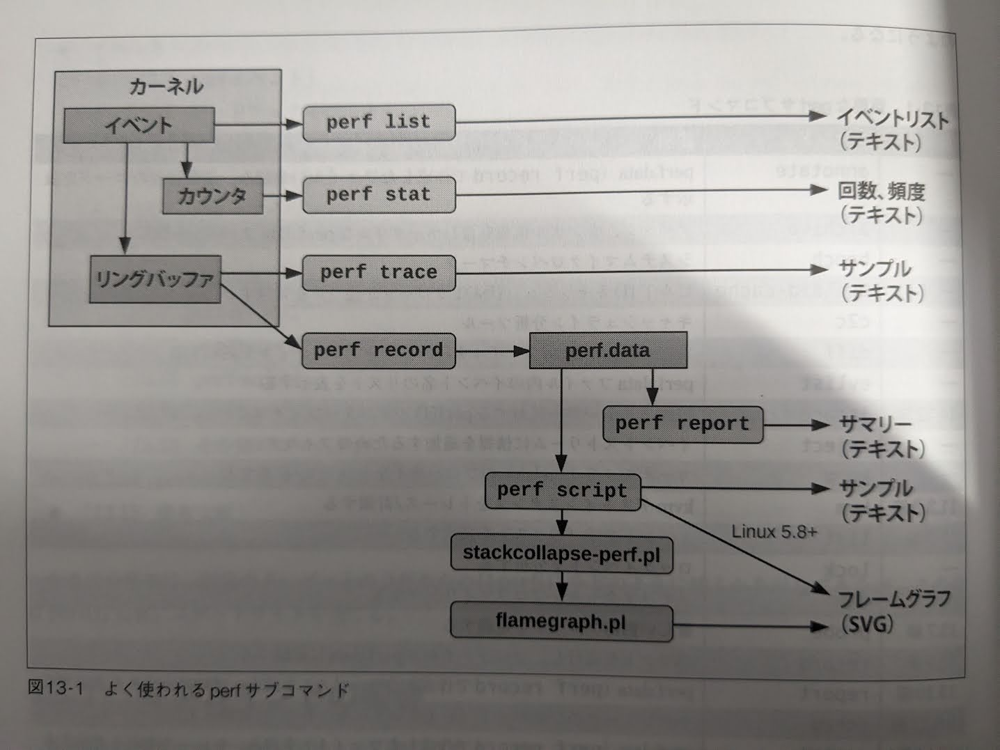

# 第13章 perf  
- perf(1)はLinuxの公式プロファイラ
- Linuxカーネルソースのtools/perf以下にソース
  - 大規模で複雑なユーザレベルプログラムでありながらLinuxカーネルソースツリーに含まれている特異な存在
- プロファイリング、トレーシング、スクリプティングの機能を持つ多機能ツール
- カーネルの`perf_events`サブシステムのフロントエンド
  - Performance Counters for Linux(PCL), Linux Performance Events(LPE)とも呼ばれる
  - PMC(Performance Monitoring Counter)の機能としてスタート
- 特にCPUの分析では他のトレーサー(Ftrace, BPF)よりも適している
<br></br>
- 本章の内容
  - サブコマンドの概要：13.1
  - 1行プログラム：13.2
  - イベント：13.3-13.7
  - コマンド：13.8-13.13
  - perfのドキュメント：13.14

## 13.1　サブコマンドの概要
- perf(1)の機能はサブコマンドによって実行
- 一般的な例
  - 2つのサブコマンドを使用
    - record: イベントをインストルメンテーションしてファイルに保存(13.9)
    - report: ファイルの内容のサマリーを表示(13.10)
  - 30秒間にわたって任意のCPUで実行されたプログラムを99Hzでサンプリング
    - 🤔コンテナで実行したためか本の出力とは異なる...
```
/# perf record -F 99 -a -- sleep 30
[ perf record: Woken up 1 times to write data ]
[ perf record: Captured and wrote 1.075 MB perf.data (19747 samples) ]

/# perf report --stdio
# To display the perf.data header info, please use --header/--header-only options.
#
#
# Total Lost Samples: 0
#
# Samples: 19K of event 'cpu-clock:pppH'
# Event count (approx.): 199464644470
#
# Overhead  Command      Shared Object      Symbol                       
# ........  ...........  .................  .............................
#
    80.09%  docker-init  [kernel.kallsyms]  [k] do_idle
    19.63%  swapper      [kernel.kallsyms]  [k] do_idle
     0.08%  docker-init  [kernel.kallsyms]  [k] __do_softirq
     0.02%  docker-init  [kernel.kallsyms]  [k] finish_task_switch.isra.0
     0.02%  runc         [kernel.kallsyms]  [k] do_idle
     0.02%  swapper      [kernel.kallsyms]  [k] __do_softirq

（省略）
```
- 重要なperfサブコマンド(表13-1を元に一部改変)

| 節 | コマンド | 説明 |  
| ---- | ---- | ---- |  
|-|annotate|perf.data(oerf recordで作成したファイル)を読み、注釈付きのコードを表示する|
|-|archive|デバッグ、シンボル情報を含むポータブルなperf.dataファイルを作る|
|-|bench|システムマイクロベンチマーク|
|-|buildid-cache|ビルドIDキャッシュ（USDTプローブが使う）を管理する|
|-|c2c|キャッシュライン分析ツール|
|-|diff|二つのperf.dataファイルを読み、差分プロファイルを表示|
|-|evlist|perf.dataファイル内のイベント名のリストを表示|
|14.12|ftrace|Ftraceトレーサーに対するperf(1)のインタフェース|
|-|inject|イベントストリームに情報を追加するためのフィルタ|
|-|kmem|カーネルメモリ(slab)のプロパティをトレース/計測する|
|11.3.3|kvm|kvmゲストインスタンスをトレース/計測する|
|13.3|list|イベントタイプのリストを表示|
|-|lock|ロックイベントを分析|
|-|mem|メモリアクセスをプロファイリング|
|13.7|probe|新しい動的プローブを定義|
|13.9|record|コマンドを実行し、プロファイルをperf.dataに記録|
|13.10|report|perf.data(perf recordで作成したファイル)を読み、プロファイルを表示|
|13.6.13|sched|スケジューラのプロパティ(レイテンシ)をトレース/計測する|
|13.11|script|perf.data(perf recordで作成したファイル)を読み、トレース出力を表示|
|13.8|stat|コマンドを実行しパフォーマンスカウンタ統計を集める|
|-|timechart|ワークロード実行中のシステムの振る舞い全体を可視化|
|-|top|リアルタイムで画面が更新される|
|13.12|trace|ライブトレーサー(デフォルトでシステムコール)| 

- よく使われるperfサブコマンドとそのデータソース、出力タイプ()



## 13.2　1行プログラム	


### 13.2.1　イベントのリストの表示


### 13.2.2　イベント数の計算
### 13.2.3　プロファイリング
### 13.2.4　静的トレーシング
### 13.2.5　動的トレーシング
### 13.2.6　レポート作成

## 13.3　perfイベント	
## 13.4　ハードウェアイベント	
### 13.4.1　周波数サンプリング
## 13.5　ソフトウェアイベント	
## 13.6　トレースポイントイベント	
## 13.7　プローブイベント	
### 13.7.1　kprobe
### 13.7.2　uprobe
### 13.7.3　USDT

## 13.8　perf stat	
### 13.8.1　オプション
### 13.8.2　インターバルごとの統計
### 13.8.3　CPU間のバランス
### 13.8.4　イベントフィルタ
### 13.8.5　シャドウ統計
## 13.9　perf record	
### 13.9.1　オプション
### 13.9.2　CPUプロファイリング
### 13.9.3　スタックウォーク
## 13.10　perf report	
### 13.10.1　TUI
### 13.10.2　STDIO
## 13.11　perf script	
### 13.11.1　フレームグラフ
### 13.11.2　トレーススクリプト
## 13.12　perf trace	
### 13.12.1　カーネルのバージョンによる違い
## 13.13　その他のコマンド	
## 13.14　perfのドキュメント	
## 13.15　参考文献	
## 実験環境
- Ubuntuコンテナ on M1 MacOS
  - Ubuntu 22.04.3 LTS
  - **セキュリティのリスクがあるがコンテナでperfを使うために特権コンテナとした(あくまでも実験用とする)**
```bash
docker run --privileged -it --name perf_exec ubuntu
```
- perfのインストール
```bash
apt update
apt install linux-tools-generic
```
- 以下のようなエラーが発生
  - どれもインストールできない
```
perf
WARNING: perf not found for kernel 6.5.11

  You may need to install the following packages for this specific kernel:
    linux-tools-6.5.11-linuxkit
    linux-cloud-tools-6.5.11-linuxkit

  You may also want to install one of the following packages to keep up to date:
    linux-tools-linuxkit
    linux-cloud-tools-linuxkit
```
- 以下のサイトを参考にエイリアスを設定
  - https://www.swift.org/server/guides/linux-perf.html
```
alias perf=$(find /usr/lib/linux-tools/*/perf | head -1)
```
- record実行時のエラー
  - 設定の変更ができなかったためprivilagedにした...
  - 参考：https://zenn.dev/termoshtt/articles/perf-tutorial1
```
# perf record -F 99 -a -- sleep 30
Error:
Access to performance monitoring and observability operations is limited.
Consider adjusting /proc/sys/kernel/perf_event_paranoid setting to open
access to performance monitoring and observability operations for processes
without CAP_PERFMON, CAP_SYS_PTRACE or CAP_SYS_ADMIN Linux capability.
More information can be found at 'Perf events and tool security' document:
https://www.kernel.org/doc/html/latest/admin-guide/perf-security.html
perf_event_paranoid setting is 2:
  -1: Allow use of (almost) all events by all users
      Ignore mlock limit after perf_event_mlock_kb without CAP_IPC_LOCK
>= 0: Disallow raw and ftrace function tracepoint access
>= 1: Disallow CPU event access
>= 2: Disallow kernel profiling
To make the adjusted perf_event_paranoid setting permanent preserve it
in /etc/sysctl.conf (e.g. kernel.perf_event_paranoid = <setting>)
```